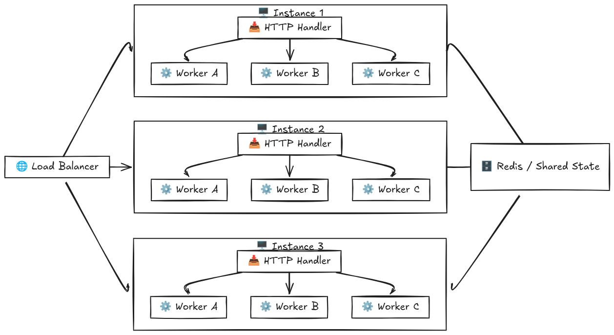

`Accumulator API`

The Accumulator API manages a shared state composed of:
- Accumulator – an integer sum of all submitted values
- Stack – a list containing all submitted values in order

Supports both local concurrency and scalable distributed deployments.

The server exposes three primary endpoints:

`Endpoints`

- `POST /add`

Adds a new integer to the system.

Behavior:
- Returns immediately with an acknowledgment.
- Actual update is performed asynchronously after a 1-second delay, simulating heavy operation.
- Background work is handled via a worker pool.

This asynchronous design enabled processing 10,000 requests in ~25 seconds without scaling, and ~2 seconds with scaling.

- `GET /state`

Retrieves either the current accumulator or the stack, based on a query parameter.

Example: \
GET /state?format=sum \
GET /state?format=list

The response always reflects the current state at the time of request (i.e. asynchronous add updates may still be pending).

- `GET /tsp`

Solves the Two-Sum problem.

Returns:
- A list containing two integers from the stack that sum to the target, or
- An empty list if no such pair exists

Uses an optimized lookup for high performance on large datasets.

Example: \
GET /tsp?target=10

`Approaches`:
1. `Local Concurrency (Single Node)`

- State is shared in-memory across worker threads.
- Synchronization primitives ensure thread-safe access to the accumulator and stack.

Ideal for single node or small scale deployments.

2. `Scalable Distributed Deployment`

Designed for horizontal scalability using:
- Docker Swarm or Kubernetes
- Redis as a distributed cache for shared state

This architecture enables:
- Consistent state across multiple instances
- Significant throughput improvements

`Mermaid diagram`

The following diagram illustrates the process.

